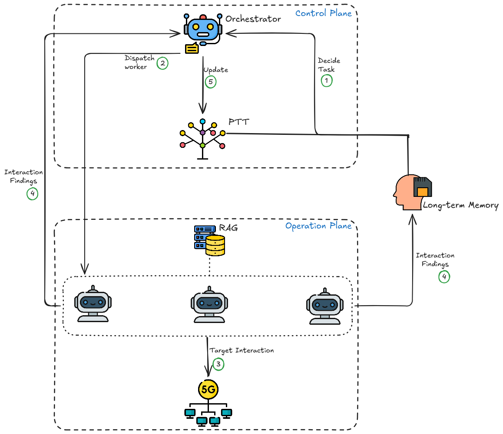

# Penetration Testing Agent Attacks

The attacks in this directory were discovered and implemented by an experimental autonomous penetration testing agent, 5G-PT (5G Penetration Tester).

This document briefly explains each attack, the architecture of the agent, and the experimental methodology used to discover and implement the attacks against the 5G core testbed.

## Agent Architecture

### Sub-Agents
5G-PT comprises a multi-agent architecture, with each sub-agent being responsible for a specific set of tasks according to the PTES methodology. 

1. The **orchestrator** is responsible for keeping track of all tasks that need to be carried out for the penetration test, deciding which task should be carried out next, and dispatching the appropriate sub-agent to complete the chosen task.

2. The **reconnaissance sub-agent** is responsible for PTES phases 1-4. These are pre-engagement, intelligence gathering, threat modeling, and vulnerability analysis. 

3. The **exploitation sub-agent** is responsible for PTES phases 5 and 6: exploitation and post-exploitation. 

4. The **reporting agent** is responsible for PTES phase 7: writing a complete report of the engagement with the target.


### Context Management and the Agentic Loop
The agentic system utilizes a hierarchical task decomposition data structure, called the Pentest Task Tree (PTT). The PTT details what has already been done and what remains to be done for the engagement to be complete. It is a hierarchical tree in which the root represents the overall penetration test task, and each child node represents a sub-task. 

Moreover, there exists an external Retrieval-Augmented Generation knowledge base containing 3GPP specifications, documentation for offensive security tools, Kubernetes documentation, and more information relevant to the 5G core and its security.

Lastly, 5G-PT maintains a persistent long-term memory, in which it stores its most crucial findings. This allows for seemingly infinite agentic iterations, since the agent's context does not get clobbered by noisy tool outputs and investigative commands, allowing only the information that is useful to the penetration test to persist longer than a single LLM session. 

The agentic loop that 5G-PT follows is consistent with the ReAct (Reasoning and Acting) framework, and can be decomposed in six steps:

1. The orchestrator decides on the next task based on information sourced from the long-term memory module and the PTT. 
2. The orchestrator dispatches the appropriate sub-agent to complete the task. 
3. The dispatched sub-agent interacts with the target environment and tries to bring the task into completion. 
4. Upon completion (whether successful or not), the sub-agent stores its most important findings in the long-term memory module and reports back to the orchestrator a brief summary of its entire interaction with the target.
5. The orchestrator integrates the findings of the interaction in the PTT (by marking the task as complete, adding subsequent tasks based on the findings of the sub-agent, etc.).
6. The loop repeats from step 1. 

The figure below offers an illustration of the described agentic loop. 



## Experimental Methodology
The engagement assumes an already-compromised foothold inside the cluster — a single pod from which the agent can reach the 5G core's internal network — since the goal is to assess the security of the 5G internals rather than the initial breach of the Kubernetes layer. From this vantage point, the attacks below are reachable because the N4 interface exposes PFCP and GTP-U to any pod that can route to the UPF, with no authentication.

5G-PT was deployed in the 5G Core Network testbed and was simply tasked with carrying out a penetration test targeting exclusively the N4 interface of the 5G core. 

The agent's performance was evaluated on three bases:
1. Whether it could independently find and exploit the attack scenarios that are already implemented in the testbed (ground truth).
2. Sub-task completion on the known attack scenarios.
3. Additional findings beyond the ground truth attack scenarios.

## Description of the Implemented Attacks
1. **State Desynchronization between the SMF and UPF:** The attacker opens a rogue PFCP association directly with the UPF and then abandons it. Because the UPF authenticates neither the origin of the association nor its subsequent heartbeats, the lapsed association eventually drives the UPF to trigger its PFCP restoration procedure, which purges the forwarding state of the sessions it is currently maintaining. The legitimate SMF, however, was never party to this exchange and continues to treat those sessions as active, leaving the control and user planes out of sync. The result is a persistent, silent denial of service: affected subscribers still appear connected from the SMF's perspective, yet the UPF holds no forwarding rules for them and they can neither send nor receive data.

2. **GPRS Tunneling Protocol User Plane (GTP-U) Data Plane Injection:** After establishing
a rogue PFCP session with a chosen Tunnel Endpoint ID (TEID), the attacker sends GTP-U G-PDU packets to the UPF, which forwards them into the 5G data plane without verifying their
origin. This exposes two compounding weaknesses – unauthenticated PFCP session creation and
unverified GTP-U traffic – and enables spoofed traffic injection that can interfere with legitimate
UE communication.

3. **GTP-U Information Disclosure (TEID Enumeration):** The UPF’s mandatory GTP-U Error Indication, sent in response to Protocol Data Unit (PDU) packets with an unrecognized TEID, reveals both the probed TEID’s status and the UPF’s internal IP address. By probing incrementing TEID values, an attacker can enumerate active sessions and their count, providing reconnaissance
for further targeted attacks.

4. **UPF Processes Error Indications Without Authentication:** The UPF acts on incoming GTP-U
Error Indication messages, normally sent by peers such as a gNodeB, without authenticating their
source. Given a valid session TEID (obtainable via the previous attack), a single unsolicited Error
Indication is enough to trigger a forwarding-rule cleanup lookup for that session. While no session
disruption was observed in our tests (likely depending on the specific 5G core implementation),
unauthenticated processing of spoofed error messages remains a valid threat vector.

## Executing the Attacks
The four implemented attack scenarios can be tested simply by executing the python scripts as root:
```bash
sudo python3 poc_*.py
```

Before executing the attacks, make sure to set the correct ```VAGRANT_DIR``` variable in each script, which must hold the value of the local directory in which the 5G Core Network deployment resides. 